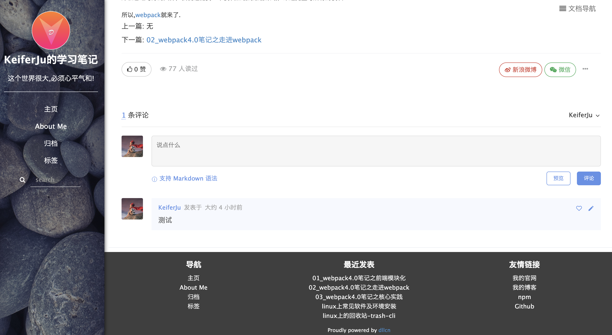

# leanote-simple-pebbles

[观看效果](http://note.myllcn.com/preview?themeId=5e40c662499442000d00007e)

根据官方主题市场生活的simple-pebbles进行修改，原主题字体大小等等都进行太大，总感觉不舒服，进行了样式微调。替换了官方disqus评论系统为gittalk，因为一些原因，Disqus国内无法使用，但是又懒得去翻，就用了基于git的gittalk。

所以此主题使用需要你处理两点。

1. 修改themem.json文件，来让页面尾部的链接都替换成你的。
2. 如果要启动gittalk评论，首先需要将你的博客设置评论选择Disqus方式，id随意，用不到了。然后在themem.json里面gitalk的对应位置填写你申请的github OAuth Apps相关信息。

