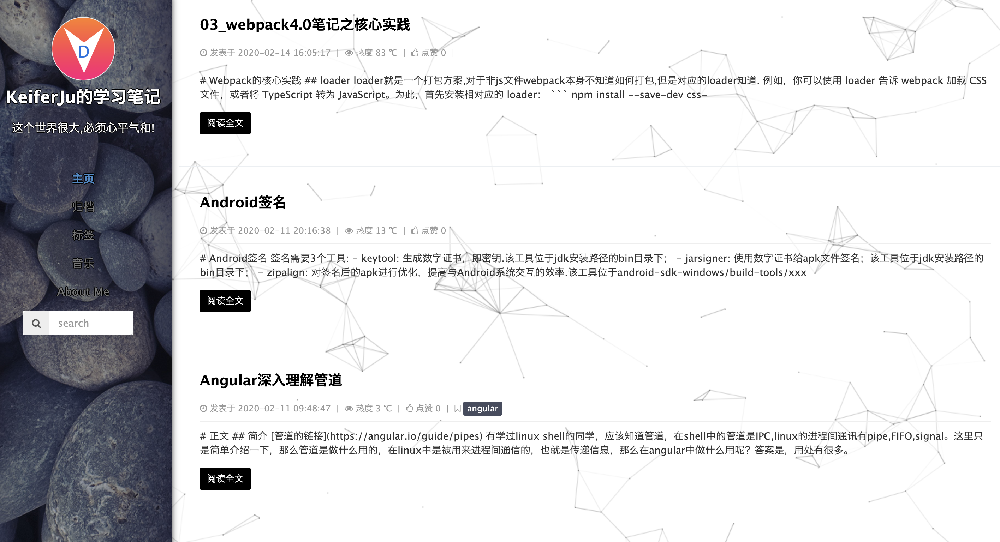
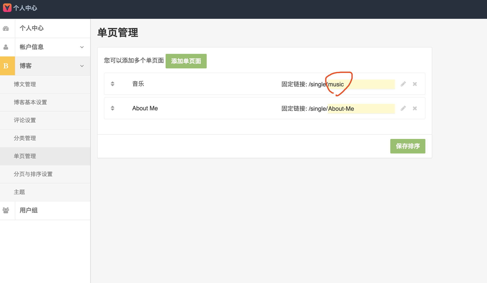

# leanote-simple-pebbles

[观看效果](http://note.myllcn.com/preview?themeId=5e477b63c8b2ff000c000069)

根据官方主题市场生活的simple-pebbles进行修改，原主题字体大小等等都进行太大，总感觉不舒服，进行了样式微调。替换了官方disqus评论系统为gittalk，因为一些原因，Disqus国内无法使用，但是又懒得去翻，就用了基于git的gittalk。



相关配置说明:
1. 如果要启动gittalk评论，首先需要将你的博客设置评论选择Disqus方式，id随意，用不到了。然后在themem.json里面gitalk的对应位置填写你申请的github OAuth Apps相关信息。


2. 如果要启用音乐单页，需要在你的博客设置里面添加一个单页，并将路由命名为music。然后可以在theme.json文件中添加自己想要的音乐。



具体配置:
```
/*
以下是本主题的配置, 采用JSON格式
其中Name, Version, Author, AuthorUrl是必填项(注意首字大写)
你也可以定义其它的配置, 如FriendLinks, 在模板文件使用 $.themeInfo.FriendLinks来获取值

注意:
1) JSON语法严格, 键必须用双引号, 最后不得有空','来结尾
2) 以下配置不能包含任何注释, 不然解析会出错!

请在此解析所有配置
* Name 主题名
* Version 主题版本
* Author 主题的作者
* AuthorUrl 作者的博客链接或相关链接
* github github角标跳转
* Postend 文章结束标记，默认打开为trun
* copyright：文章结尾版权信息，默认打开为trun
* canvasBg: 打开canvas背景，默认关闭false

* FriendLinks 友情链接

* gitalk 评论系统相关配置
  clientID clientID
  clientSecret clientSecret
  repo  用来存储评论的仓库名
  owner 管理员
  admin 谁可以初始化仓库，是个数组，一般填写管理员就行了
* music 音乐单页
    name	-	音频名称
    artist	-	音频艺术家
    url	-	音频链接
    cover	-	音频封面
    lrc	-	歌词详情
    theme	-	切换到此音频时的主题色，比上面的 theme 优先级高
*/
{
  "Name": "dllcn-simple-pebbles",
  "Version": "1.0",
  "Author": "myllcn.com",
  "AuthorUrl": "http://myllcn.com",
  "github": "https://github.com/KeiferJu",
  "Postend": true,
  "copyright": true,
  "canvasBg": false,
  "FriendLinks": [
    {"Title": "我的官网", "Url": "http://myllcn.com"},
    {"Title": "我的博客", "Url": "http://blog.myllcn.com"},
    {"Title": "npm", "Url": "https://www.npmjs.com/~jkf19980216"},
    {"Title": "Github", "Url": "https://github.com/KeiferJu"}
  ],
  "gitalk": {
    "clientID": "xxx",
    "clientSecret": "xxx",
    "repo": "xxx",
    "owner": "xxx",
    "admin": ["xxx"]
  },
  "music": [
    {"name":"RightNow","artist":"RightNow","url":"http://blog.myllcn.com/music/RightNow.mp3","cover":""},
    {"name":"怒放的生命","artist":"汪峰","url":"http://link.hhtjim.com/qq/001faIUs4M2zna.mp3","cover":""}
  ]
}
```

